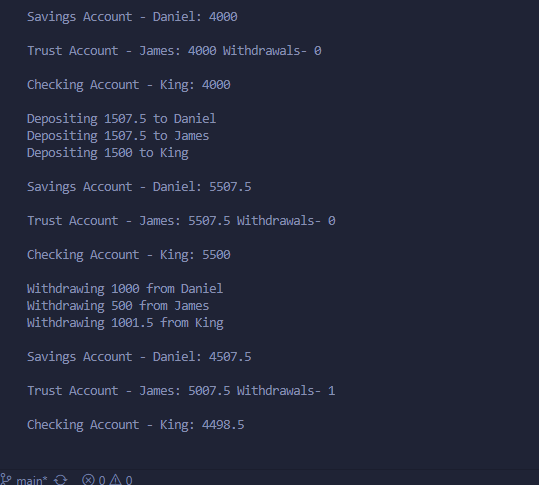

#THIS IS THE BACKEND SOFTWARE A SIMPLE BANKING SYSTEM.

IT CONSISTS OF THREE FUNCTIONALITIES;
1. WITHDRAW
2. DEPOSIT
3. PRINT ACCOUNT DETAILS(ACCOUNT TYPE, USERNAME, BALANCE )
 
IT CONSISTS OF THREE TYPES OF ACCOUNTS FOR WHICH A PERSON COULD HAVE;
- A SAVINGS ACCOUNT(adds a particular int_rate to each withdrawal)
- A CHECKING ACCOUNT(reduces a certain amount for each withdrawal)
- A TRUST ACCOUNT(only allows maximum of 3 withdrawals where each can be only a max of 20% of accounts alue)

The Output of the Main.cpp can be seen below

